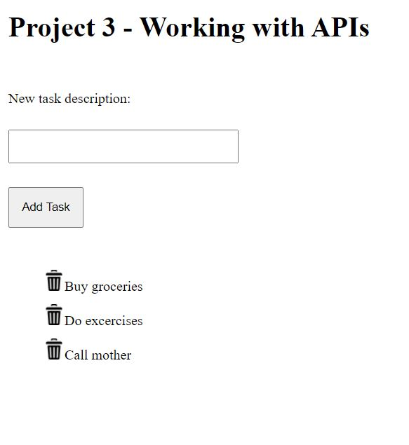
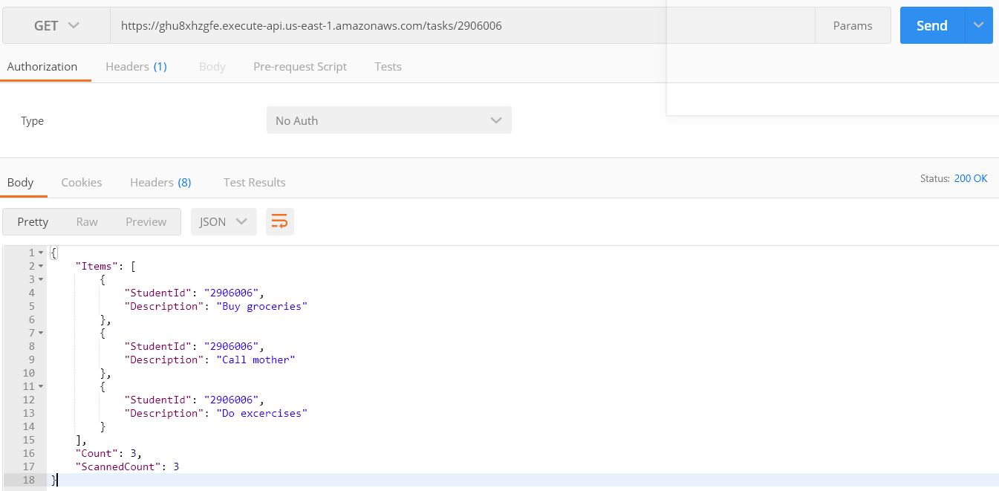

# Task manager
## Task manager overview  
* Allow users to add new tasks. The user should enter a task description and click the add button. The add button should then callback to the api to insert a new task. Once the new task is added, the api will return an empty object as confirmation. Upon receiving the response, the task should be added to the list of all tasks  
* Allow users the ability to delete tasks. Each tasks in the list of all tasks should include a button that will remove the task using the API. You will need to pass the task description along with your student id. Once the task is deleted, the api will return an empty object as confirmation. Upon receiving the response, the task should be removed from the list of all tasks  
* All of the taks on the page should be output when the page initially loads (using client side code). The api has a method to retrieve all tasks as json. You should retrieve all of all tasks and output all of them using client side dhtml.  
--- 
### Concepts uses:
* DHTML  
* Event Handling  
* AJAX  
* API Keys  
* Content-Types: Request & Response  
* Asynchronous Programming  
---
### Screenshots
  <h4> Input</h4>
    

  <h4> Postman GET view</h4>
    
